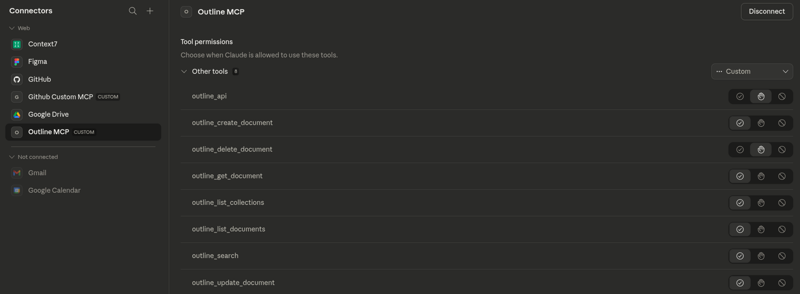
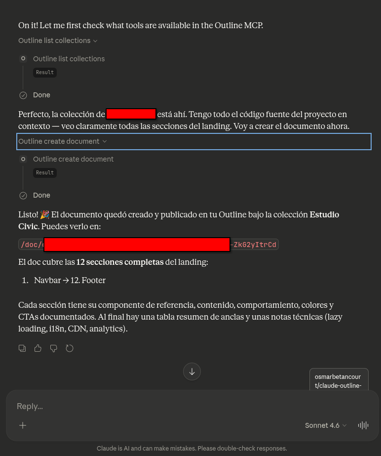
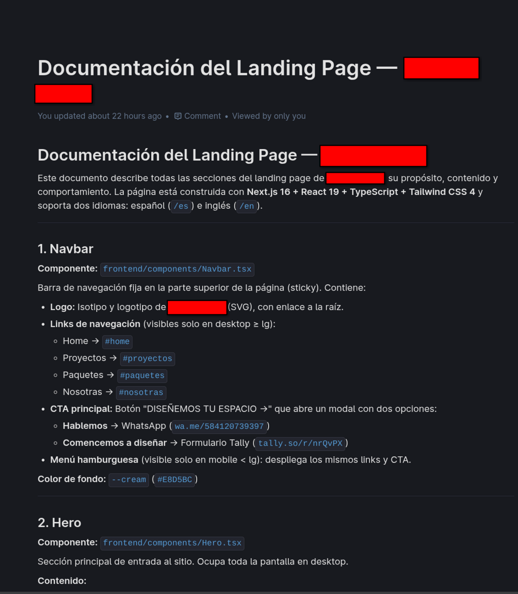

# Claude Outline Connector


<p align="center">
	
</p>
<p align="center" style="font-size:0.95em; color:#888;">
	<em><strong>Disclaimer:</strong> This project is not affiliated with or endorsed by Anthropic. The Claude logo is used solely to visually associate this repository with Claude and the MCP protocol.</em>
</p>

> **A remote MCP server that connects Claude to your self-hosted [Outline](https://www.getoutline.com/) wiki. Claude can search, read, create, and update your documents — from Claude.ai, Claude Code, or Claude mobile.**

---


## Connected in Claude.ai



## Claude using it in a conversation



## Result generated inside Outline



---


## Key Features

- **Full Outline API coverage:** Search, read, create, update, and delete documents and collections. Plus `outline_api` to call any of Outline's 100+ endpoints without a server update.
- **OAuth 2.1 + PKCE:** Secure, standards-compliant auth flow — works natively with Claude.ai's connector dialog.
- **Zero infrastructure overhead:** Your Outline instance stays fully on-prem. Only this small proxy needs a public HTTPS URL.
- **Docker Compose ready:** Runs alongside Caddy on a shared Docker network. HTTPS handled automatically.

---


## Quick Start

```bash
git clone https://github.com/osmarbetancourt/claude-outline-connector.git
cd claude-outline-connector

cp .env.example .env
$EDITOR .env  # fill in the required values

docker network create caddy_net  # shared network with Caddy (once per host)
docker compose up -d --build
```

---


## Environment Variables

Copy `.env.example` to `.env`:

| Variable | Required | Description |
|---|---|---|
| `OUTLINE_BASE_URL` | Yes | Base URL of your Outline instance, e.g. `https://wiki.example.com` |
| `OUTLINE_API_KEY` | Yes | Outline API key — Outline → Settings → API → New token |
| `MCP_HOST` | No | Bind host (default: `0.0.0.0`) |
| `MCP_PORT` | No | Bind port (default: `8765`) |
| `MCP_SERVER_URL` | OAuth only | Public HTTPS URL of this server, e.g. `https://mcp.example.com` |
| `OAUTH_CLIENT_ID` | OAuth only | Any string — enter the same value in Claude.ai's connector dialog |
| `OAUTH_CLIENT_SECRET` | OAuth only | Strong random secret — enter the same value in Claude.ai's connector dialog |

Generate a secret:
```bash
python -c "import secrets; print(secrets.token_urlsafe(32))"
```

> Leave all OAuth vars empty for local dev — the server runs without auth.

---


## Connect to Claude.ai

1. Go to **claude.ai → Settings → Connectors → Add custom connector**
2. **Server URL:** `https://mcp.yourdomain.com` *(no `/mcp` suffix)*
3. **OAuth Client ID / Secret:** the values from your `.env`
4. Click **Add** — Claude handles the OAuth flow automatically

### Claude Code CLI

```bash
claude mcp add --transport http outline https://mcp.yourdomain.com/mcp \
  --header "Authorization: Bearer <access_token>"
```

---


## Available Tools

| Tool | Description |
|---|---|
| `outline_search` | Search documents by keyword |
| `outline_get_document` | Get full document content |
| `outline_list_collections` | List all collections |
| `outline_list_documents` | List documents in a collection |
| `outline_create_document` | Create and publish a new document |
| `outline_update_document` | Update title and/or content |
| `outline_delete_document` | Delete a document permanently |
| `outline_api` | Call **any** Outline API endpoint directly |

---


## Example Usage

**Search your wiki:**
```
"Search my Outline wiki for anything about deployment"
```

**Create a document:**
```
"Create a new document titled 'Meeting Notes 2026-03-05' in the Engineering collection"
```

**Use the power tool:**
```
"Star the document with id abc-123 using outline_api"
```

---


## Deployment (VPS + Caddy)

**1. Create the shared network (once per host)**
```bash
docker network create caddy_net
```

**2. Add an entry to your Caddyfile**
```
mcp.yourdomain.com {
    reverse_proxy outline-mcp:8000
}
```

**3. Deploy**
```bash
docker compose up -d --build
```

Caddy resolves the container by name on the shared network and handles HTTPS automatically.

---


## Troubleshooting

**`421 Misdirected Request`** — `MCP_SERVER_URL` doesn't match the domain Caddy forwards. Set it to the exact public URL (no trailing slash).

**`401 Unauthorized` from Outline** — check `OUTLINE_API_KEY`. Generate a new one at `https://your-outline/settings/tokens`.

**OAuth flow fails** — test the discovery endpoint:
```bash
curl https://mcp.yourdomain.com/.well-known/oauth-protected-resource
```

**Claude.ai says "Could not connect"** — confirm the server is reachable:
```bash
curl -X POST https://mcp.yourdomain.com/mcp \
  -H "Content-Type: application/json" \
  -d '{"jsonrpc":"2.0","id":1,"method":"tools/list","params":{}}'
# should return 401 Unauthorized
```

---


## License

This project is licensed under the MIT License. See [LICENSE](LICENSE) for details.

## Support / Contact

For questions, feedback, or support, contact: **oaba.dev@gmail.com**

<p align="center">
	<i>Made with ❤️ for on-prem Outline users.<br>
	<b>Give Claude access to your knowledge base.</b></i>
</p>
